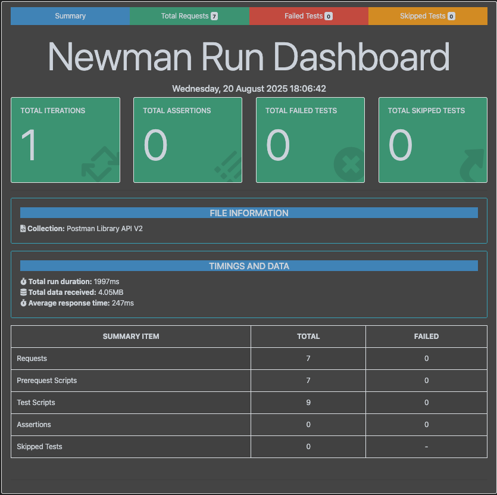

# qa-apis-postman-sample

Sample repository for demonstrating how to run **Postman Collections** with **Newman** in a CI/CD pipeline using **GitHub Actions**.

[](https://github.com/rmgoede/qa-apis-postman-sample/actions/workflows/postman-ci.yml)


---

## 🔗 Quick Links
- 📊 [Latest Test Report](https://rmgoede.github.io/qa-apis-postman-sample/report.html)  
- ⚙️ [Workflow Runs](https://github.com/rmgoede/qa-apis-postman-sample/actions)

---

## 📖 Overview
This repository shows how to:

- Store and version Postman collections in GitHub.
- Automatically run API tests via Newman on every commit.
- Generate HTML & JUnit reports.
- Publish the HTML report to GitHub Pages for easy sharing.

---

## 🚀 CI/CD Workflow

The workflow (`.github/workflows/postman-ci.yml`) does the following:

1. **Trigger**: Runs on every push or pull request to `main` that changes Postman collections or workflow config.  
2. **Run Tests**:  
   - Installs Newman + reporters  
   - Executes the Postman collection with CLI + HTML + JUnit reporters  
3. **Artifacts**:  
   - Uploads the `newman` folder as a downloadable build artifact  
   - Prepares the HTML report for deployment  
4. **Deployment**:  
   - Publishes the latest HTML report to GitHub Pages  

📄 Example Workflow Snippet:

```yml
name: API Tests

on:
  push:
    branches: [ "main" ]

jobs:
  newman:
    runs-on: ubuntu-latest
    steps:
      - uses: actions/checkout@v4
      - name: Run Newman tests
        run: newman run postman/Postman\ Library\ API\ V2.postman_collection.json
```
---

## 📊 Reports

- **Latest HTML Report:** [👉 View Report](https://rmgoede.github.io/qa-apis-postman-sample/report.html)  
- **Artifacts (per workflow run):**
  - `report.html` (HTML dashboard)  
  - `results.xml` (JUnit format, CI-friendly)  

📸 **Example Report Screenshot** (click to open the live report):

[](https://rmgoede.github.io/qa-apis-postman-sample/report.html)
